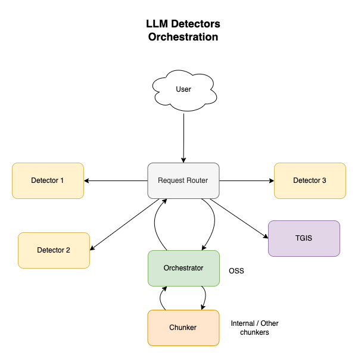

# FMS Guardrails Orchestrator

Orchestrator server for invocation of detectors on text generation input and output [name subject to change]



## Getting Started

Make sure Rust and Cargo are [installed](https://doc.rust-lang.org/cargo/getting-started/installation.html).
Make sure you install protobuf.

### Instructions for Fedora
```sh
# Install system dependencies
sudo dnf install git rustup gcc perl

# Install protoc
PROTOC_VERSION=26.0
cd /tmp
curl -L -O https://github.com/protocolbuffers/protobuf/releases/download/v${PROTOC_VERSION}/protoc-${PROTOC_VERSION}-linux-x86_64.zip
unzip protoc-*.zip -d /usr/local && rm protoc-*.zip

# Install Rust tools
rustup-init -y
. ~/.bashrc # If you're on bash, so commands rustc and cargo become available.

To build and install the binary locally:
```sh
cargo install --path .
```

To run the server locally:
```sh
cargo run --bin fms-guardrails-orchestr8
```

To run tests:
```sh
cargo test
```

To build documenation:
```sh
cargo doc
```

If you wish to contribute to the project, make sure you install pre-commit hooks to have automated checks for Rust before every commit (requires [pre-commit](https://pre-commit.com) to be installed in the system).

```
# You can skip this step if you already have it installed.
pip install pre-commit
```

Once you have pre-commit installed, run the following command on the project folder to install the pre-commit hooks:
```
pre-commit install
```

### Sample requests

1. Guardrails with text generation
```bash
curl -v -H "Content-Type: application/json" --request POST --data '{"model_id": "dummy_model_id", "inputs": "dummy input"}' http://localhost:8033/api/v1/task/classification-with-text-generation
```
2. Guardrails with streaming text generation
```bash
curl -v -H "Content-Type: application/json" --request POST --data '{"model_id": "dummy_model_id", "inputs": "dummy input"}' http://localhost:8033/api/v1/task/server-streaming-classification-with-text-generation
```
3. Health Probe
```bash
curl -v http://localhost:8033/health
```

