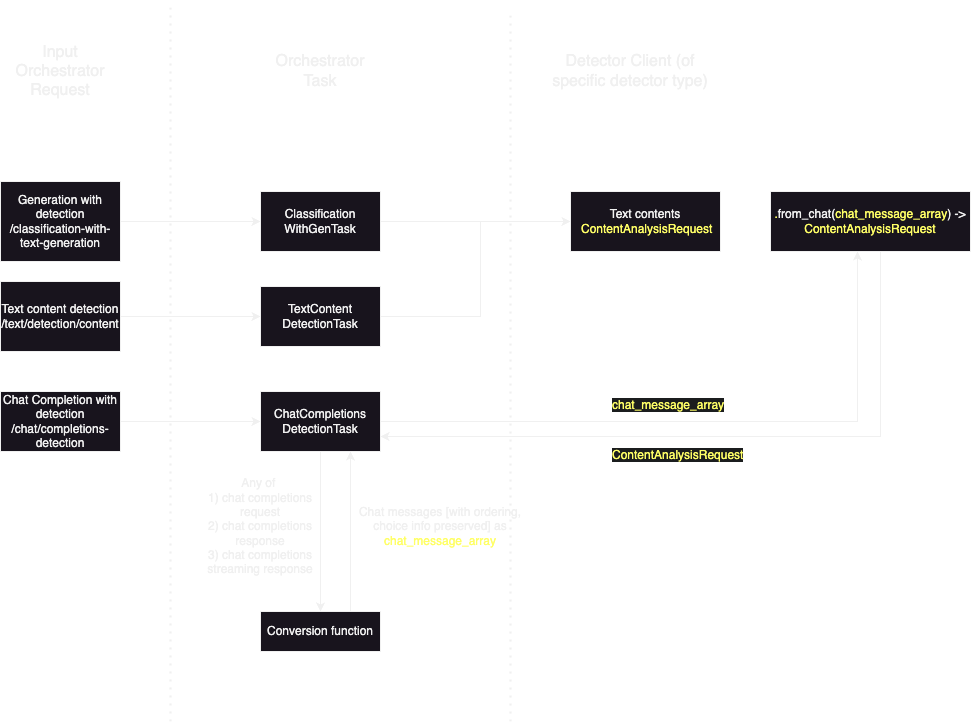

# ADR 009: Detector type rules

This ADR defines the concept of "rules" on detector types and gives some examples of documented rules and how they should be applied. This ADR is not intending to document rules exhaustively for various detector types.

## Motivation

As mentioned in the [chat completion support ADR](./005-chat-completion-support.md), users may want to apply various [detector types](./006-detector-type.md) when using detectors with endpoints that include generation. We want to define some way of guiding how various detector types can be applied with various generation strategies (such as chat message generation vs. text generation), as detector types work on differing amounts of information. [`text/contents` detectors](https://foundation-model-stack.github.io/fms-guardrails-orchestrator/?urls.primaryName=Detector+API#/Text/text_content_analysis_unary_handler) work on an array of text, while [`text/chat` detectors](https://foundation-model-stack.github.io/fms-guardrails-orchestrator/?urls.primaryName=Detector+API#/Text/chat_analysis_unary_handler_api_v1_text_chat_post) work on entire chat histories.

## Decisions

### Rules

The "rules" on detector types are intended to be applied for the purposes of validating the request inputs for detector types and/or updating the request inputs for detector types, when detectors are used in various contexts, such as being called on various generation-with-detection endpoints. Different rules can be applied based on detectors when they are used on user prompts vs. detectors when they are used on output of a generative model. Rules can also specify whether or not detectors should be used on user prompts or outputs of generative models or both.

### `/text/contents` rules on chat completions

The [OpenAI chat completion messages](https://platform.openai.com/docs/api-reference/chat/create) can be provided with numerous roles. At time of writing, the roles include: `system`, `user`, `assistant`, `tool`, `function`.

The following rules apply for detections on chat completions. Namely this is for endpoints that include generation and not standalone detection.

- `contents` detectors will not get applied on `function` or `tool` messages. The messages might not make sense here for detection since they could include code. If there are use cases later for this, we can consider applying other modalities of detectors e.g. "code" detectors, or reversing this rule.
- `contents` detectors will only get applied on the last message of the input. We do this to not repeat/re-process chat message history [input of chat-completions], especially where chat history will keep getting added to. Alternatively we always process each `content` [since technically an array can be processed], but this would be more in line with the `chat` detectors that take whole chat history as inputs.

NOTE: If a user-remediable "rule" is broken, validation errors are expected to be returned.

#### Behavior implication on chat completions with detections endpoint:
- On detections on unary output, only messages with applicable roles will be considered for detection. This still applies to every output choice, where each choice is considered independent of each other.
- On detections on streaming output, the same applies. The only difference is the messages are obtained from `choice.delta.content` instead of `choice.message.content`.

### Strategies of rule application

Various strategies of rule application were considered and listed below. Each is described with rationale of why this was or was not the selected decision.

(a) At the detector client level - Today detector clients are detector endpoint-specific and are invoked e.g. `client.text_contents(detector_id, text_contents_request, request_headers)` where `client` is, for example, of `TextContentsDetectorClient` type. The original user request to orchestrator endpoints is currently _not_ passed to detector clients. This would break the current assumption that detector clients only have the information necessary to call detectors. By the time the detector client is invoked, however, the "context" of the call is lost (i.e. whether this detector was called from chat completions [chat messages] or just generation [text]). The request passed to the detector client calls only has the information needed to call the detector.

(b) At the task level - Currently the tasks closely proxy the orchestrator endpoints. Each task includes the user request parameters, such as `detectors`. However, one issue with attempting to apply rules at this level is the `detectors` by this point only have `detector_id` mapped to detector parameters. The particular `detector_type` for each detector is not tracked at the task level. In each "handler" function of the task, the particular detector clients are fetched with the `detector_id` information, with detector calls being invoked.

(c) At the orchestrator endpoint handler level - The detector endpoints will still have to be specifically invoked as mentioned in (b), but this will allow rule application on the entire request, specific to the request format that the particular orchestrator endpoint expects.

The diagram below shows how we intend for rules to be applied in the stack:

At the time of writing, as noted in (b) of the previous section, the orchestrator task does not currently have `detector_type` information. The diagram illustrates that this part could be refactored to include such information, or currently the conversion functions can be provided at the task level but still invoked by the orchestrator endpoint handler.

The `conversion function` will convert or extract the parts of any object (whether request or response) that will be applicable for the detector request. For chat completions, the `Message` portion of request or response objects is the part to be extracted into a new message object (`chat_message_array` in the diagram) that will still include information on where the message came from (such as which choice in the response).

When new requests for detectors such as the `/text/contents` detectors is formed, a `from_` function can be invoked to convert the new message object to the expected request format. Here, any "filtering" of the object can be done. For messages this can include extracting only the last message of a list, or filtering by `role`.

## Consequences

- Rules for detector types are defined and will be applied via `from_` functions when detector requests are constructed. There may have to exist many `from_` functions in the codebase to account for the variety of detector types to make compatible with various generation requests/responses.
- "Conversion functions" will help convert various request or response objects in preparation for rule application.
- Without refactoring, the conversion functions and application of rules will have to be applied at the orchestrator endpoint handler level, but this can be altered.
